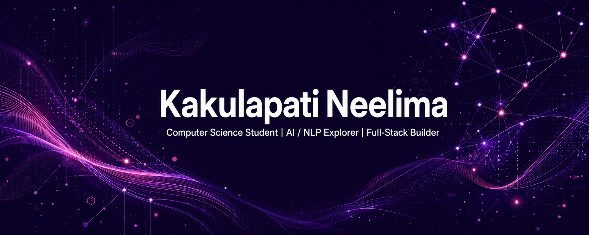

<div align="center">

<a href="https://neelima-16.github.io/"></a>

<br/>


<a href="https://git.io/typing-svg"></a>

<br/>

<a href="https://www.linkedin.com/in/kakulapati-neelima/"></a>
<a href="https://neelima-16.github.io/"></a>
<a href="https://github.com/Neelima-16"></a>

</div>

<br/>

<div align="center">
<a href="#-about-me">ABOUT</a>&nbsp;&nbsp;✦&nbsp;&nbsp;<a href="#-toolkit">TOOLKIT</a>&nbsp;&nbsp;✦&nbsp;&nbsp;<a href="#-featured-work">WORK</a>&nbsp;&nbsp;✦&nbsp;&nbsp;<a href="#-activity">ACTIVITY</a>&nbsp;&nbsp;✦&nbsp;&nbsp;<a href="#-lets-connect">CONNECT</a>
</div>

---

## ✦ About Me

<table>
  <tr>
    <td width="34%" align="center">
      <a href="https://github.com/Neelima-16"></a>
      <br/><br/>
      
    </td>
    <td width="66%">
      <h3>Curious by default. Intentional by design.</h3>
      <p>I am a Computer Science student at MIC College of Technology, exploring the space where intelligent systems, data, and thoughtful web experiences meet.</p>
      <p>I learn by building—from NLP experiments and data notebooks to full-stack productivity apps. Every project is a chance to make an idea clearer, kinder, and more useful.</p>
      <br/>
      
      
      
      
    </td>
  </tr>
</table>

<br/>

```ts
const neelima = {
  learning: ["AI/ML", "NLP", "Web Development"],
  building: "practical, people-first digital experiences",
  values: ["curiosity", "consistency", "craft"],
  nextGoal: "turn promising ideas into meaningful products",
};
```

---

## ✦ Toolkit

<div align="center">


<br/>


<br/>


<br/>


</div>

---

## ✦ Featured Work

<div align="center">

<a href="https://github.com/Neelima-16/Track-Save"></a>
<a href="https://github.com/Neelima-16/To-Do-List-"></a>

<br/>


</div>

<!-- PROJECTS:START -->
<!-- This table is generated by .github/workflows/update-projects.yml. -->
| # | Project | Description | Stack | Stars |
|:---:|:---|:---|:---|:---:|
| 1 | [Neelima-16](https://github.com/Neelima-16/Neelima-16) | — | `Shell` | 0 |
| 2 | [Neelima-16.github.io](https://github.com/Neelima-16/Neelima-16.github.io) | portfolio website | `TypeScript` | 0 |
| 3 | [EV_Charging_Demand_Week1](https://github.com/Neelima-16/EV_Charging_Demand_Week1) | As electric vehicles continue to grow, predicting charging demand becomes increasingly important. This project leverages machine learning techniques to forecast charging requirements using historical and environmental data. The solution demonstrates how predictive analytics can support smarter infrastructure planning and efficient energy management | `Jupyter Notebook` | 0 |
| 4 | [Track-Save](https://github.com/Neelima-16/Track-Save) | TrackNSave helps users take control of their personal finances through an intuitive and responsive web application. From recording daily expenses to visualizing spending patterns, the platform makes financial management simple and insightful. Built with a modern full-stack architecture, the application focuses on usability, performance | `TypeScript` | 0 |
| 5 | [ai-news-summarizer-dashboard](https://github.com/Neelima-16/ai-news-summarizer-dashboard) | Keeping up with today's news can be overwhelming. This platform simplifies information by automatically summarizing lengthy articles while analyzing public sentiment using Natural Language Processing. Designed with an interactive dashboard, it enables users to understand the core message of news articles in seconds, making information more access | `Python` | 0 |
| 6 | [codealpha_tasks](https://github.com/Neelima-16/codealpha_tasks) | — | `Python` | 0 |
| 7 | [NLP-Journey](https://github.com/Neelima-16/NLP-Journey) | My complete NLP learning journey (Day 1–Day 80) | `—` | 0 |
| 8 | [To-Do-List-](https://github.com/Neelima-16/To-Do-List-) | This is a gamified to-do list web app built with MERN stack .It turns task completion into plant growth — users earn Growth Points (GP) to evolve their virtual plants. Features include streak tracking, achievements, reminders, task categories, and a garden-themed UI with day/night modes and focus mode for better productivity. | `JavaScript` | 0 |
<!-- PROJECTS:END -->

---

## ✦ Activity

<div align="center">


<br/>


<br/>

<a href="https://github.com/Neelima-16"></a>

</div>

---

## ✦ Contribution Garden

<div align="center">


<br/>

<sub>· Every square is a small step forward.</sub>

</div>

---

## ✦ Let’s Connect

<div align="center">

<h3>Have an idea worth building? Let’s make it real.</h3>

<a href="https://www.linkedin.com/in/kakulapati-neelima/"></a>
<a href="https://neelima-16.github.io/"></a>

<br/><br/>


</div>
#
